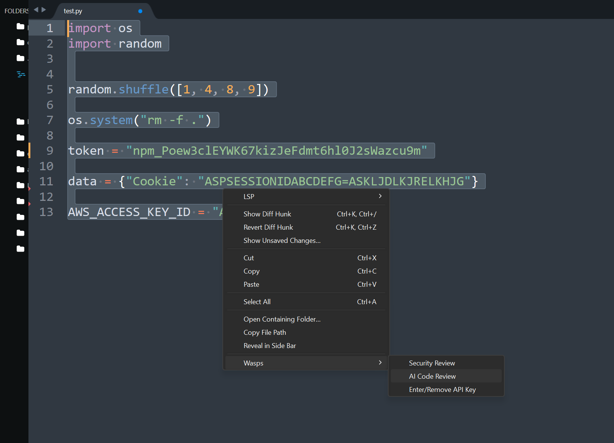
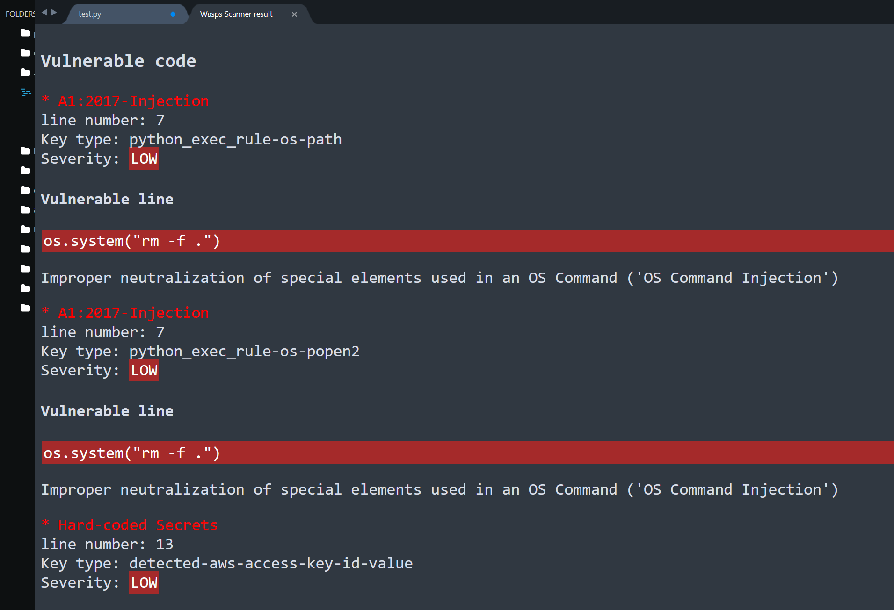

# AI Code Review in Your IDE

</img>

## What is Wasps?

**Wasps** is an AI code review tool in your IDE that helps you with context-aware review feedback as you write your code. It helps improve the quality and security of your codebase using Gitsecure and AI under the hood, while making your development workflow more efficient and enjoyable.

</img>

## Installation

The best way is to install it via [Package Control](https://packagecontrol.io/packages/wasps). Once you have Package Control setup in Sublime Text, open the command palette and search for Package Control: Install Package. Search for `wasps` and install it. Package Control will take care for of automatically updating the package for you if there are new releases.

You can also use Package Control: Add Repository. Copy the github url (without the .git at the end) and enter it into the input panel that pops up at the bottom when you select Package Control: Add Repository. Now use Package Control: Install Package and search for Jinja2 and install it.

## What can you do with Wasps?

### Code Summary

Wasps provides comprehensive AI-powered code summaries directly within your editor, helping you understand a particular piece of code instantly.

### Code Quality Analysis

Enhance your development workflow with static code analysis, which helps identify potential issues before they become problems:

- Detection of code smells and bugs.
- Insights into code complexity and maintainability.

### Code Security Analysis

Using Gitsecure under the hood, Wasps is able to perform various types of security analysis, helping identify potential issues before they become problems:

- Static Application Security Testing (SAST).
- Secret detection.
- Infrastructure as Code Security (IaC) - Coming soon.
- Dependency security analysis - Coming soon.

### Fix Recommendations

Wasps not only identifies issues but also provides actionable fix recommendations:

- Automated suggestions for code refactoring.
- Quick fixes for common errors and anti-patterns.
- Context-specific advice tailored to your codebase.

### Chat (Coming Soon)

Interact with Wasps for real-time assistance and support:

- Ask questions about your code and get instant answers.
- Receive explanations of complex code.
- Benefit from personalized code reviews based on your queries.

### Supported Languages and IDEs

Wasps supports over 30 programming languages, ensuring you get the help you need regardless of your tech stack. You can see the full list of supported languages [here](https://docs.gitsecure.dev/code).

### Tips & Tricks

- You can review any code by highlighting it, as shown below:
- To review an entire file, simply right-click on it and select the appropriate option.

## Additional Resources

For more information on using Wasps, refer to the following resources:

- [Wasps website](http://www.wasps.dev/)
- [Wasps documentation](https://docs.gitsecure.dev/wasps)

**Enjoy coding with Wasps!**
